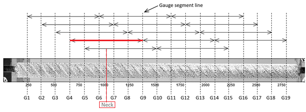

Preparation of sample:
1.  Determine the cross-sectional area, So, of the specimen. 
2.  The test shall be carried out on the standard test pieces prepared in accordance with IS 1608, using a proportional gauge length. Lo=5.65√So, where Lo is the gauge length and So is the cross-sectional area of the test piece. Lo may rounded to the nearest multiple of 5 mm, provided that the difference between the calculated and marked gauge length is less than 10 % of Lo.Note that test pieces with a non-proportional gauge length, may be used; in this case, the elongation values shall be converted in accordance with IS 3803 (Part 1).
3.  A series of overlapping gauge lengths as shown in the figure below separated by 5 or 10mm are marked on the specimen.The marks could not result in premature fracture.

 
  
 

Figure: A series of gauge segment lines, main gauge segment including the neck is shown in red (source: https://doi.org/10.1002/suco.201800042)

<strong>
Testing:
</strong>

<ol>
  <li>
    Insert the specimen in the UTM such that the centers of the grips are in alignment with the axis of the specimen at the beginning and during the test. Attach the extensometer carefully. Record simultaneously the readings of load from the UTM and elongation from the extensometer.
  </li>
  <li>
    Select a load range for the UTM that will accommodate the maximum anticipated load during the test. Apply load by prescribed rate. Within the elastic range the rate of stressing shall be between 6 MPa/sec and 60 MPa/sec. Within the plastic range the straining rate shall not exceed 0.0025/s for determination of yield strength and 0.008/s for determination of tensile strength.Remove the extensometer close to ultimate stress.
  </li>
  <li>
    After failure, fit the broken halves together and measure the final ‘gauge’ length, Lf and the smallest diameter.
  </li>  
  <li>
    Determine tensile strength, yield strength, percentage elongation after fracture from the stress-strain diagram.
  </li>
</ol>

<strong>
Observations & Calculations:
</strong>

<table>
  <tr>
    <td>
    Type of steel:
    </td>
    <td>
    Rathi Shaktiman- Fe 500
    </td>
  </tr>
  <tr>
    <td>
    Shape and size of cross section:
    </td>
    <td>
    Deformed circular, 12 mm
    </td>
  </tr>
</table>

<table>
  <tr>
    <td>Specimen no.</td>
    <td>1</td>
    <td>2</td>
    <td>3</td>
    <td>Average</td>
  </tr>
  <tr>
    <td>Weight, w (g)</td>
    <td></td>
    <td></td>
    <td></td>
    <td></td>
  </tr>
  <tr>
    <td>Length, L (mm)</td>
    <td></td>
    <td></td>
    <td></td>
    <td></td>
  </tr>
  <tr>
    <td>Effective cross section area, So = w/7.85L (mm2)</td>
    <td></td>
    <td></td>
    <td></td>
    <td></td>
  </tr>
  <tr>
    <td>Effective diameter, d (mm)</td>
    <td></td>
    <td></td>
    <td></td>
    <td></td>
  </tr>
  <tr>
    <td>Original Gauge length, Lo* = 5.65√So(mm)</td>
    <td></td>
    <td></td>
    <td></td>
    <td></td>
  </tr>
  <tr>
    <td>Chosen Gauge Length, Lo</td>
    <td></td>
    <td></td>
    <td></td>
    <td></td>
  </tr>
  <tr>
    <td>Yield stress (MPa)</td>
    <td></td>
    <td></td>
    <td></td>
    <td></td>
  </tr>
  <tr>
    <td>Tensile strength (MPa)</td>
    <td></td>
    <td></td>
    <td></td>
    <td></td>
  </tr>
  <tr>
    <td>TS/YS ratio</td>
    <td></td>
    <td></td>
    <td></td>
    <td></td>
  </tr>
  <tr>
    <td>Gauge length after fracture, Lu (mm)</td>
    <td></td>
    <td></td>
    <td></td>
    <td></td>
  </tr>
  <tr>
    <td>% Elongation after fracture, (Lu-Lo)/Lo×100</td>
    <td></td>
    <td></td>
    <td></td>
    <td></td>
  </tr>
</table>

<strong>
Results:
</strong>

Yield stress (MPa, to nearest whole number): 
Tensile strength: 
Tensile strength/Yield stress ratio:  
Percentage elongation (to the nearest 0.5 %): 

