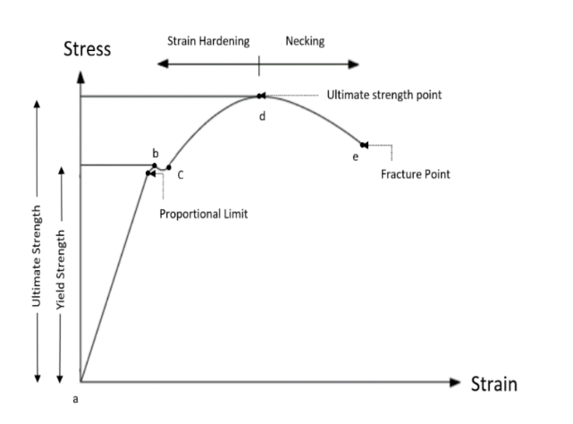
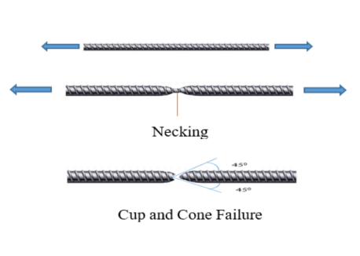
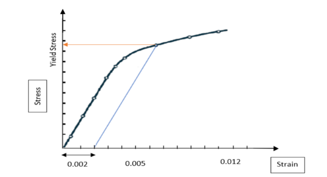
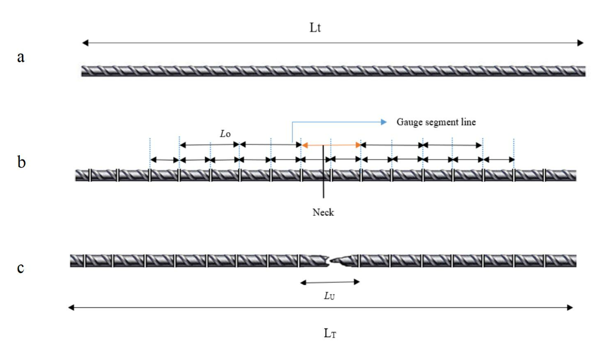

Steel is the most used structural material for the construction of civil engineering structures. Structural steel includes rolled shapes and plates. Steel is also used as the reinforcement in combination with cement concrete. Reinforced concrete members are constructed so that steel resists all tension and the compression is resisted by concrete or concrete and steel together. Reinforcing bars are made either plain or deformed. Deformed bars create a better bond between concrete and steel.

Mechanical tests for steel include tension, bending, hardness and impact. For structural steel and reinforcing bars, tensile test, a destructive material test, is the most important. Tensile test provides relevant information for evaluation of the tensile properties and for quality assurance purposes. One usually conducts a tensile test on a standard specimen of the material to obtain the stress-strain diagram of a material. The diagram representing the relation between stress and strain in a given material is an important characteristic of the material. Important basic properties, viz., the proportional limit, elastic limit, the yield strength, the ultimate stress, the elongation at fracture, young’s modulus, etc. can be obtained from the stress-strain diagram. An idealized stress strain curve for steel is shown in Figure 1. An axially loaded tension member exhibits an elastic range (a–b) ending at yielding (b), followed by yield plateau (b–c). In the yield plateau, the load almost remains constant as the elongation increases. On further loading, the material exhibits a smaller increase in tension due to reorientation of the crystal structure of the metal with elongation (c–d). This region is referred to as the strain hardening range. After reaching the ultimate load (d), the loading decreases as the elongation increases (d–e), until the specimen eventually fractures at (e). The region (d-e) is referred to as the necking range. Since ductile materials are strong in tension, the failure is caused by shear stresses. The direction of the shear makes an angle of 450 with the applied stress. Thus, the plane of failure is at 450 from the axis of the shaft, and the failure is known as cup and cone failure because of the fracture surface.

  
Figure 1: Engineering Stress-Strain Curve of metallic materials. 

 
 Figure 2: Cup and Cone Failure 

Some materials, such as cold formed steel, due to their specific microstructure, do not show a sharp yield point but rather they yield continuously. For such steels, the yield stress is always taken as the stress at which a line at 0.2 per cent strain, parallel to the elastic portion, intercepts the stress strain curve. This is shown in Figure 3.

  
Figure 3: Determination of yield strength by offset method. 

The following are the properties of steel determined from Stress-strain curve:
<ul>
<li>Proportional limit — It is the region in the stress-strain curve which obeys the Hooke’s Law. In this region, the ratio of stress with strain gives a constant called Young’s Modulus.</li>
<li>Modulus of elasticity or Young’s Modulus, E — It is a measure of a material’s axial stiffness; it does not change with the type of steel and has the value of 2.5 × 105 MPa.</li>
<li>Elastic limit — It is the point in the graph up to which the material returns to its original position when the load acting on it is completely removed.</li>
<li>Yield stress, σy — It is the stress at which elongation first occurs in the test piece without increasing the load during the tensile test. In the case of steels with no such definite yield point, proof stress shall be applicable.</li>
<li>0.2 percent proof stress — It is the stress at which a non-proportional elongation equal to 0.2 percent of the original gauge length takes place.</li>
<li>Ultimate or tensile strength, σu — It is the maximum load reached in a tensile test divided by the initial cross-sectional area. It is the largest value of stress that the material can support. Ideally, the yield stress and ultimate strength should be calculated based on reduced area of cross section, but it is not practical to determine reduced area of cross section at various stages of loading. Thus, this stress is also called the engineering stress.</li>
<li>Fracture Stress — It is the stress at which the failure of the material takes place.</li>
<li>Percentage permanent elongation (after fracture): The amount of permanent strain from proportionality limit to the point of rupture or fracture is a measure of ductility. It is measured by computing the percentage elongation of the test specimen over the specified or standard gauge length. It is given by: Percentage permanent elongation = ( Lu - Lo )/ Lo ×100

  where Lo is the gauge length before application of force and Lu is the gauge length after rupture of the test piece. The two pieces having been carefully fitted back together so that their axes lie in a straight line.</li>
<li>Percentage Total Elongation at Maximum Force — It is the percentage elongation corresponding to the maximum load reached in a tensile test expressed as a percentage of the original gauge length. It is also termed as uniform elongation and is recorded before initiation of necking.</li>
</ul>

In civil engineering structures, since the methods of structural analysis are based on linear elasticity, the value of elastic limit, modulus of elasticity, yield stress, tensile strength and elongation parameters are very important design parameters. IS:1786 covers the requirements of deformed bars for use as reinforcement in concrete, in the following strength grades:

<ol>
<li>Fe415, Fe415D, Fe415S</li>
<li>Fe500, Fe500D, Fe500S</li>
<li>Fe550, Fe550D</li>
<li>Fe600</li>
<li>Fe650</li>
<li>Fe700</li>
</ol>

The expression following the symbol Fe indicate the specified minimum yield stress or 0.2 percent proof stress in MPa. The letter D and S following the strength grade indicates the categories with same specified minimum yield stress or 0.2 proof stress but with enhanced and additional requirements. The mechanical properties required of high strength deformed bars as per IS:1786 are presented in Table 1.

Rebar's surface is often "deformed" with ribs, lugs, or indentations to promote a better bond with the concrete and reduce the risk of slippage. The size of deformed bars is provided as nominal size, that is defined as the diameter of a plain round bar having the same mass per metre length as the deformed bar. The nominal sizes of manufactured bars are as follows (in mm): 4, 5, 6, 8, 10, 12, 16, 20, 25, 28, 32, 36 and 40. The nominal size and nominal mass of the reinforcement shall be consistent with IS 1786 (2008) and are given in Table 1.

Table 1: Mechanical properties of high strength deformed bars.
<table>
<thead>
  <tr>
    <th>S. No</th>
    <th>Property</th>
    <th>Fe 415</th>
    <th>Fe 415D</th>
    <th>Fe 500</th>
    <th>Fe 500D</th>
    <th>Fe 550</th>
    <th>Fe 550D</th>
    <th>Fe 600</th>
  </tr>
</thead>
<tbody>
  <tr>
    <td>1</td>
    <td>0.2% proof stress/ yield stress, Min N/mm2</td>
    <td>415</td>
    <td>415</td>
    <td>500</td>
    <td>500</td>
    <td>550</td>
    <td>550</td>
    <td>600</td>
  </tr>
  <tr>
    <td>2</td>
    <td>Elongation %, Min on gauge length 5.65√𝐴 where A is cross sectional area of test piece</td>
    <td>14.5</td>
    <td>18</td>
    <td>12</td>
    <td>16</td>
    <td>10</td>
    <td>14.5</td>
    <td>10</td>
  </tr>
  <tr>
    <td>3</td>
    <td>Tensile strength, Min</td>
    <td>10% more than actual yield stress but not less than 485 N/mm2</td>
    <td>12% more than actual yield stress but not less than 500 N/mm2</td>
    <td>8% more than actual yield stress but not less than 545 N/mm2</td>
    <td>10% more than actual yield stress but not less than 565 N/mm2</td>
    <td>6% more than actual yield stress but not less than 585 N/mm2</td>
    <td>8% more than actual yield stress but not less than 600 N/mm2</td>
    <td>6% more than actual yield stress but not less than 660 N/mm2</td>
  </tr>
  <tr>
    <td>4</td>
    <td>Total elongation at maximum force (%), Min on gauge length 5.65√𝐴</td>
    <td></td>
    <td>5</td>
    <td></td>
    <td>5</td>
    <td></td>
    <td>5</td>
    <td></td>
  </tr>
</tbody>
</table>

Table 2: Nominal size and nominal mass of the reinforcement bars.
<table>
<thead>
  <tr>
    <th>S. No.</th>
    <th>Nominal Size (mm)</th>
    <th>Cross-sectional area (mm2)</th>
    <th>Mass per meter (kg)</th>
  </tr>
</thead>
<tbody>
  <tr>
    <td>1</td>
    <td>4</td>
    <td>12.6</td>
    <td>0.099</td>
  </tr>
  <tr>
    <td>2</td>
    <td>5</td>
    <td>19.6</td>
    <td>0.154</td>
  </tr>
  <tr>
    <td>3</td>
    <td>6</td>
    <td>28.3</td>
    <td>0.222</td>
  </tr>
  <tr>
    <td>4</td>
    <td>8</td>
    <td>50.3</td>
    <td>0.395</td>
  </tr>
  <tr>
    <td>5</td>
    <td>10</td>
    <td>78.6</td>
    <td>0.617</td>
  </tr>
  <tr>
    <td>6</td>
    <td>12</td>
    <td>113.1</td>
    <td>0.888</td>
  </tr>
  <tr>
    <td>7</td>
    <td>16</td>
    <td>201.2</td>
    <td>1.58</td>
  </tr>
  <tr>
    <td>8</td>
    <td>20</td>
    <td>314.3</td>
    <td>2.47</td>
  </tr>
  <tr>
    <td>9</td>
    <td>25</td>
    <td>491.1</td>
    <td>3.85</td>
  </tr>
  <tr>
    <td>10</td>
    <td>28</td>
    <td>615.8</td>
    <td>4.83</td>
  </tr>
  <tr>
    <td>11</td>
    <td>32</td>
    <td>804.6</td>
    <td>6.31</td>
  </tr>
  <tr>
    <td>12</td>
    <td>36</td>
    <td>1018.3</td>
    <td>7.99</td>
  </tr>
  <tr>
    <td>13</td>
    <td>40</td>
    <td>1257.2</td>
    <td>9.86</td>
  </tr>
  <tr>
    <td colspan="4">Density of steel: 7850 kg/m3.</td>
  </tr>
</tbody>
</table>

<strong>Test Method</strong>
<ol>
<li><strong>Determining the effective cross-sectional area</strong> 
  For bar whose pattern of deformation is such that by visual inspection, the cross-sectional area is substantially uniform along the length of the bar/wire, the effective cross-sectional area shall be the gross sectional area determined as follows, using a bar/wire not less than 0.5 m in length:

Gross cross-sectional area, in mm2 So= w/0.00785L

where w = mass weighed to a precision of +0.5 percent, in kg

L = length measured to a precision of +0.5 percent, in m.

  The nominal Diameter (d0) is determined as the diameter of a plain round bar having the same mass per meter length as the deformed bar.</li>
<li><strong>Determining the gauge length</strong> As a rule, test pieces with a proportional gauge length complying with the requirements Lo = 5.65√So should be used for the tensile test, where Lo is the gauge length and So is the effective cross-sectional area of the test piece. Note that test pieces with a non-proportional gauge length, other than 5.65 may be used in which case the elongation values shall be converted to 5.65 in accordance with IS 3803 (Part 1).</li>
<li><strong>Loading rate</strong> For the tensile test, usually a strain-controlled test is adopted. This method is used when strain rate sensitive parameters are to be determined and to minimize the uncertainty of the test results. Strain rate value shall be equal to 0.00025 s-1 with a relative tolerance of ± 20% .
  <strong>Properties which can be determined using method A:</strong>Upper yield strength or proof strength, lower yield strength, percentage yield point extension, tensile strength, percentage elongation after fracture, percentage total extension at maximum force, percentage plastic extension at maximum force and percentage reduction in the area of the specimen can be determining using Method A.  </li>
<li><strong>Estimation of mechanical properties</strong> The following are the terms and definitions which are used in the experiment:

Total length (LT) — Total length of test piece before the test.

Total length after fracture (LT) — Total length of test piece after the rupture, at room temperature, the two pieces having been carefully fitted back together so that their axes lie in a straight line.

Original gauge length (L0) — Length between gauge length marks on the test piece measured at room temperature before the test.

Final gauge length after fracture (LU) — Length between gauge length marks on the test piece measured after rupture, at room temperature, the two pieces having been carefully fitted back together so that their axes lie in a straight line. Percentage elongation after fracture is estimated as permanent elongation of the gauge length after fracture ( LU – L0 ), expressed as a percentage of the original gauge length ( L0 ).</li>

</ol>

 

 
Figure 4: Specimen a) before fracture b) after fracture.
 

<strong>Apparatus:</strong>
<table>
<thead>
  <tr>
    <th>Name</th>
    <th>Accuracy / Least Count</th>
  </tr>
</thead>
<tbody>
  <tr>
    <td>Universal Testing Machine</td>
    <td>Conforming to IS:1828 Part 1 ( 2015 )</td>
  </tr>
  <tr>
    <td>Weighting Balance</td>
    <td>1 gram</td>
  </tr>
  <tr>
    <td>Ruler</td>
    <td>1 mm</td>
  </tr>
  <tr>
    <td>Extensometer </td>
    <td>Conforming to ISO:9513 Class 1 ( 2012 )</td>
  </tr>
</tbody>
</table>
