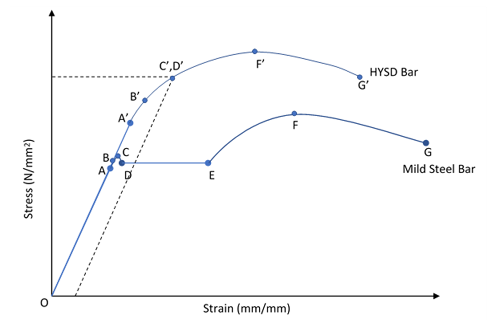
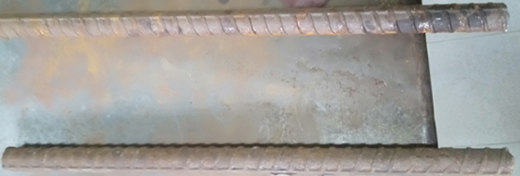
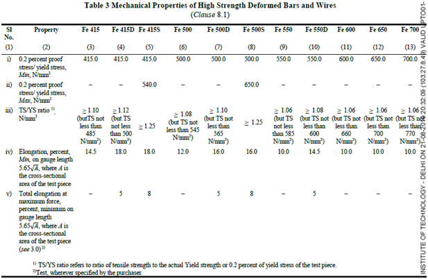

Steel is the most used structural material for the construction of civil engineering structures. Stress strain diagram represent the relation between stress and strain for a given material and is an important characteristic of the material. The stress-strain curve for steel is generally obtained from tensile test on standard specimens. An idealized stress strain curve for steel is shown below. An axially loaded tension member exhibits an elastic range (O–A) ending at yielding (B), followed by yield plateau (B-E). In the yield plateau, the load almost remains constant as the elongation increases to more than ten times the yield strain. On further loading, the material exhibits a smaller increase in tension due to reorientation of the crystal structure of the metal with elongation (E–F). This region is referred to as the strain hardening range. After reaching the ultimate load (F), the loading decreases as the elongation increases (F–G), until the specimen eventually fractures at (G).High strength steels, due to their specific microstructure, do not show a sharp yield point but rather theyyield continuously. For such steels, the yield stress is always taken as the stress at which a line at 0.2 per cent strain, parallel to the elastic portion, intercepts the stress strain curve.

 
  
   
A & A’ = Proportionality limit 
B & B’ = Elastic Limit 
C = Upper yield point 
D = Lower yield point 
OA & OA’ = Linear Curve 
DE = Plastic region 
EF = Strain Hardening 
FG = Necking Region 
F = Ultimate strength Point 
G = Fracture point 
Slope of OA = Modulus of elasticity 
Figure: Engineering stress-strain curve for mild steel and high yield strengthsteel

The following are the properties of steel determined from Stress-strain curve:
<ul>
<li>
  <strong>Yield Stress, σy</strong> — Stress at which elongation first occurs in the test piece without increasing the load during the tensile test. In the case of steels with no such definite yield point, proof stress shall be applicable.
</li>
<li>
    <strong>Ultimate or tensile Strength, σu</strong> — Maximum load reached in a tensile test divided by the effective cross-sectional area. Ideally, the yield stress and ultimate strength should be calculated based on reduced area of cross section are, but it is not practical to determine reduced area of cross section at various stages of loading. Thus, this stress is also called the nominal or the engineering stress. Similarly, the engineering strain is taken as the ratio of the change in length to original length. It is the largest value of stress that the material can support. This value is commonly used to determine the maximum or nominal strength of a member.
</li>
<li>
     <strong>Modulus of elasticity, E</strong> —It is a measure of a material's axial stiffness; it does not change with the type of steel and has the value of 2.5 × 105 MPa.
</li>
<li>
     <strong>Percentage permanent elongation (after fracture)</strong>:The ductility of steel, defined as its capacity to undergo large inelastic deformations without significant loss of strength, is animportant consideration in analysis and design of steel structures. It is one of thefounding pillars of limit state design approach. The amount of permanent strain fromproportionality limit to the point of rupture or fracture is a measure of ductility. Thus, the ductility of steel can be measured by computing the percentage elongation of the testspecimen over the specified or standard gauge length given by, 5.65√So where So is the effective cross sectional area of the specimen. It is measured by percentage 
  </li>
  </ul>
permanent elongation after fracture: 
Elongation = (Lu-Lo)/Lo×100 
where 
Lo is the original gauge length 
Lu is the final gauge length after fracture. The two pieces having been carefully fitted back  together so that their axes lie in a straight line. 
<ul>
<li>
  <strong>Percentage Total Elongation at Maximum Force</strong> — Elongation corresponding to the maximum load reached in a tensile test (also termed as uniform elongation, before initiation of necking).
</li>

</ul>

In civil engineering structures, since the methods of structural analysis are based on linear elasticity, the value of elastic limit, modulus of elasticity, yield stress, tensile strength and elongation parameters are very important design parameters.IS:1786 covers the requirements of deformed bars for use as reinforcement in concrete, in the following strength grades:

<ol type="a">
  <li> Fe415, Fe415D, Fe415S</li>
  <li> Fe500, Fe500D, Fe500S</li>
  <li> Fe550, Fe550D</li>
  <li> Fe600</li>
  <li> Fe650</li>
  <li> Fe700</li>
</ol>

The figure following the symbol Fe indicate the specified minimum yield stress or 0.2 percent proof stress in MPa. The letter D and S following the strength grade indicates the categories with same specified minimum yield stress or 0.2 proof stress but with enhanced and additional requirements. The nominal sizes of bars is as follows (in mm): 4, 5, 6, 8, 10, 12, 16, 20, 25, 28, 32, 36 and 40. Rebar's surface is often "deformed" with ribs, lugs or indentations to promote a better bond with the concrete and reduce the risk of slippage as shown in the picture below.

 
  
 
Figure: Transverse and Longitudinal rib

The rebars shall withstand the mechanical properties determined on effective cross-sectional area as shall be as specified in Table 3 of  IS:1786. The effective cross-sectional area, So, is the average cross-sectional area in mm2 given by

So = w/7.850L,

where w = mass in g and L = length in mm.

 
  
 

Test Condition: 23 °C ± 5 °C. 

#### Apparatus, Materials:

Universal Testing Machine (UTM) with applicable tensile grips 
Mechanical extensometer 
Calipers 
Mechanical dividers 
Machinist scale 
Gauge length punch and hammer 
