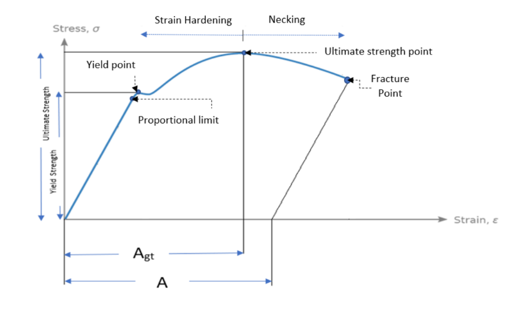
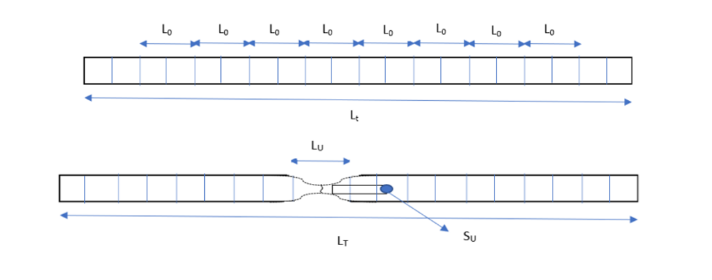
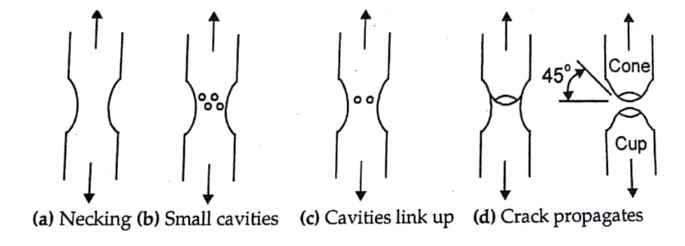

The tensile test of a standard steel specimen to failure provides the important basic properties of steel, viz., the proportional limit, elastic limit, the yield strength, the ultimate stress, the elongation at fracture and the stiffness, i.e., the Young’s modulus of elasticity. This data of the test enables to control the quality of production, setting the required performance level and checking the suitability of the product for a particular application.

Now let’s understand the basic properties of steel which are determined from the Engineering stress-strain curve.
(Engineering stress-strain curve):

Stress strain curve has different regions and points, which are as follows:

1. Proportional limit:

  It is the region in the strain curve which obeys Hooke’s Law. In this region, the ratio of stress with strain gives a constant called Young’s Modulus.

2. Elastic limit:

  It is the point in the graph up to which the material returns to its original position when the load acting on it is completely removed.

3. Yield Point:

  It is the point at which the material starts to deform plastically.

4. Ultimate Stress Point:

  It is the point corresponding to the maximum stress that a material can handle before failure and this stress is known as Ultimate stress.

5. Fracture Point:

  It is the point in the curve at which the failure of the material takes place.

Ideally, the ultimate strength would have been calculated based on reduced area of cross section, but it is not practical to determine reduced area of cross section at various stages of loading. Thus, this stress is also called the nominal or the engineering stress.

$$Engineering stress = {Instantaneous force \over Initial  cross  section  area}$$

$$Engineering strain = {Enlongation \over Initial Lenght}$$

<h3>Test Pieces</h3>

Terms and definitions:

1. Original gauge length (L)

Length between gauge length marks on the test piece measured at room temperature before the test.

2. Total length ( Lt )

Total length of test piece before the test.

3. Total length after fracture ( LT )

Total length of test piece after the rupture, at room temperature, the two pieces having been carefully fitted back together so that their axes lie in a straight line.

4. Parallel length (Lc)

Length of the parallel reduced section of the test piece.

5. Chosen gauge Length (L0)

It is the original gauge length rounded to nearest multiple of 5 mm.

6. Final gauge length after fracture (LU)

Length between gauge length marks on the test piece measured after rupture, at room temperature, the two pieces having been carefully fitted back together so that their axes lie in a straight line.

7. Nominal Diameter (d0)

The diameter of a plain round bar having the same mass per metre length as the deformed bar.

8. Maximum force (Fm)

Highest force that the test piece withstands during the test.

9. Stress

At any moment during the test, force divided by the original cross-sectional area, (S0), of the test piece.

10. 0.2 Percent Proof Stress

Stress at which a non-proportional elongation equal to 0.2 percent of the original gauge length takes place

11. Tensile strength

The maximum load reached in a tensile test divided by the effective cross-sectional area of the gauge length portion of the test piece.

12. Yield stress

Stress at which elongation first occurs in the test piece without increasing the load during the tensile test. In the case of steels with no such definite yield point, proof stress shall be applicable.

13. Percentage elongation after fracture (A)

Permanent elongation of the gauge length after fracture ( $L_U$ − $L_0$ ), expressed as a percentage of the original gauge length ( $L_0$ ).

14. Percentage total extension at maximum force ( $A_{gt}$ )

The elongation corresponding to the maximum Load reached in a tensile test.

<h3>Test Pieces</h3>

<h4>Shape and dimensions</h4>

The cross-section of the test pieces may be circular, square, rectangular, annular or, in special cases, some other uniform cross-section. Preferred test pieces have a direct relationship between the original gauge length, L0, and the original cross-sectional area, S0, expressed by the formula

$$L = {k\sqrt{S_0}}$$

Where, k is a coefficient of proportionality and the test pieces are called proportional test pieces. The internationally adopted value for k is 5.65 The original gauge length shall be not less than 15 mm. When the cross-sectional area of the test piece is too small for this requirement to be met with k = 5.65, a higher value (preferably 11.3) or a non-proportional test piece may be used.

<h3>Determination of Effective Cross-Sectional Area:</h3>

The effective cross-sectional area shall be the gross sectional area determined as follows, using a bar not less than 0.5 m in length.

$$Gross cross-sectional area, in mm2 = { 𝑤 \over 7.850𝐿 }$$

where w = mass in g and L = length in mm

<h3>Test Piece Nominal Mass shall be consistent with IS 1786 (2008)</h3>

Nominal size: The diameter of a plain round bar having the same mass per metre length as the deformed bar.

Nominal mass: The mass of the bar of nominal size and of density 0.00785 Kg/mm2 per meter.

The values for the nominal cross-sectional area and nominal mass of individual bars/wires shall be as given in Table 1.

//image of table 1

The values of the Table1 are subjected to the Tolerance on the nominal mass as a function of nominal size is given in Table2.

//image of table 2

<h3>Testing Rate</h3>

The testing of reinforcement bars can be done by two methods.

<h3>Method A (strain controlled)</h3>
In this method the specimen is clamped at the end and pulled/pushed such that rate of increase/decrease in length of specimen is constant. In this process at some point of time, stress value may be constant while strain value keeps constantly changing.

Hence used for calculating the lower yield point, this method is used.

<h3>Method B (stress controlled)</h3>
In this method the specimen is clamped at the end and pulled/pushed at a constant rate, such that at any point of time, stress value is constant while the strain may or may not be constant.

Hence used for calculating the upper yield point, this method is used.

<h3>Cup and Cone Failure</h3>
When the rebar is subject to uniaxial tensile loading, elongation of the specimen takes place in axial direction and hence reduction of cross-sectional area in transverse direction which is called necking. When the load is continuously applied, formation of small cavities takes place in the necked region which links up to form cracks on further applying of the load. Since the maximum shear stress is at 45° which results into the cup and cone failure.

