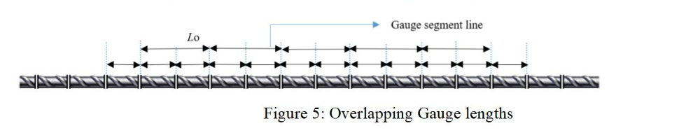
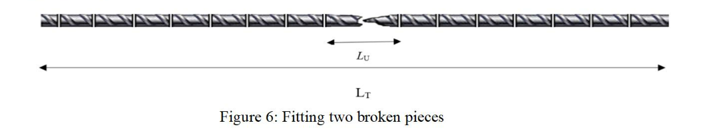

<h5>Procedure</h5>
Test Condition: 23 °C ± 5 °C.
 
These steps will be followed for the experiment 
<h5>Determining the effective cross-sectional area</h5>
<ol>
<li>Measure the total length of the specimen using a measuring tape in meter up to 3rd decimal place.</li>
<li>Measure the weight of the specimen on a weighing balance in Kg up to 3rd decimal place.</li>
<li>Calculate the cross-sectional area (So), of the specimen. So = 𝑤 / 7.850𝐿 , w = weight(g) and L = total length(mm)
</li>
</ol>
<h5>Choosing gauge length, Lo</h5>
<ol>
<li>Determine the original gauge length from Lo = k √So , the specimen have a direct relationship between the original gauge length and the original cross-sectional area (So), where k is a coefficient of proportionality. The internationally adopted value for k is 5.65.

Lo may round to the nearest multiple of 5 mm, provided that the difference between the calculated and chosen gauge length is less than 10 % of Lo.</li>
</ol>
<h5>Marking</h5>
<ol><li>
Mark the specimen at the regular interval of Lo/2 or Lo/3. A series of overlapping gauge lengths as shown in the figure below are marked which are separated by 30 and 60 mm.
</li></ol>
 

 

<h5>Placement of specimen</h5>
<ol>
<li>Insert the specimen in the UTM such that the centers of the grips are in alignment with the axis of the specimen at the beginning and during the test. Attach the extensometer carefully.</li>
</ol>

<h5>Rate of Loading</h5>

<ol>
<li>Set the strain rate value equal to 0.00025 s-1 with a relative tolerance of ± 20% . The strain rate shall be kept as constant as possible throughout the whole experiment.</li>
<li>Record simultaneously the readings of load from the UTM and elongation from the extensometer.</li>
<li>Measure the maximum value of stress prior to the first decrease in stress from the stress-strain curve. This value corresponds to yield strength.</li>
<li>Remove the extensometer close to ultimate stress.</li>
<li>Measure the maximum value of stress achieved in the experiment. This value corresponds to ultimate strength.</li>
<li>After failure, fit the two pieces together so that their axes lie in a straight line and measure the final ‘gauge’ length, LU and the smallest diameter.</li>
 

 
<li>Determine ratio of tensile strength and yield strength and the percentage elongation after fracture from the stress-strain diagram.</li>
</ol>
<h5> Observations & Calculations:</h5>

Grade of steel _______ 

Shape and size of cross section _______ 

Rate of loading _______ 
<table>
  <tr>
    <td>Specimen no.</td>
    <td>1</td>
    <td>2</td>
    <td>Average</td>
  </tr>
  <tr>
    <td>Weight, w (g)</td>
    <td></td>
    <td></td>
    <td></td>
  </tr>
  <tr>
    <td>Length, L (mm)</td>
    <td></td>
    <td></td>
    <td></td>
  </tr>
  <tr>
    <td>Effective cross section area, So = w/7.85L ( mm2 )</td>
    <td></td>
    <td></td>
    <td></td>
  </tr>
  <tr>
    <td>Effective diameter, d (mm)</td>
    <td></td>
    <td></td>
    <td></td>
  </tr>
  <tr>
    <td>Original Gauge length, L = 5.65√So (mm)</td> 
    <td></td>
    <td></td>
    <td></td>
  </tr>
  <tr>
    <td>Chosen Gauge Length, Lo</td>
    <td></td>
    <td></td>
    <td></td>
  </tr>
  <tr>
    <td>Yield stress (MPa)</td>
    <td></td>
    <td></td>
    <td></td>
  </tr>
  <tr>
    <td>Tensile strength (MPa)</td>
    <td></td>
    <td></td>
    <td></td>
  </tr>
  <tr>
    <td>TS/YS ratio</td>
    <td></td>
    <td></td>
    <td></td>
  </tr>
  <tr>
    <td>Gauge length after fracture, Lu (mm)</td>
    <td></td>
    <td></td>
    <td></td>
  </tr>
  <tr>
    <td>% Elongation after fracture, (Lu-Lo)/Lo×100</td>
    <td></td>
    <td></td>
    <td></td>
  </tr>
</table>

<h5> Results:</h5>

<table style="undefined;table-layout: fixed; width: 563px">
<colgroup>
<col style="width: 370px">
<col style="width: 193px">
</colgroup>
<thead>
  <tr>
    <th>Date of Test</th>
    <th></th>
  </tr>
</thead>
<tbody>
  <tr>
    <td>Yield strength (MPa, to nearest whole number)</td>
    <td></td>
  </tr>
  <tr>
    <td>Tensile strength (MPa, to nearest whole number)</td>
    <td></td>
  </tr>
  <tr>
    <td>Percentage elongation after fracture (to the nearest</td>
    <td></td>
  </tr>
  <tr>
    <td>0.5%)</td>
    <td></td>
  </tr>
  <tr>
    <td>Percentage reduction of area (to the nearest 1%)</td>
    <td></td>
  </tr>
</tbody>
</table>

<h5>Precautions:</h5>
<ol>
<li> Marking of gauge length should be perpendicular to the longitudinal axis of the specimen.</li>

<li> The specimen inserted in the UTM should not slide while applying the tensile load.</li>

<li> Ensure that the extensometer is isolated from any kind of vibrations.</li>

<li> The final gauge length is measured when the axes of the two broken pieces lie in a straight line.</li>
</ol>
